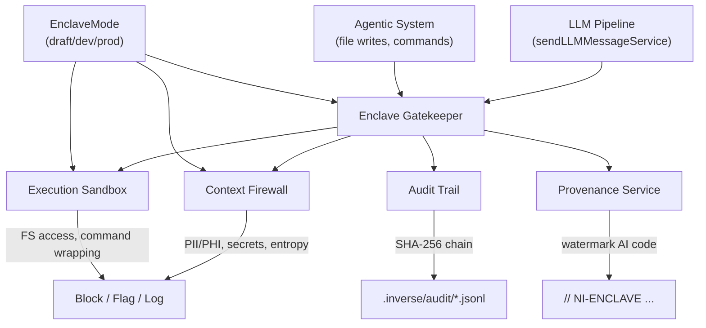

# Neural Inverse Enclave — Implementation Walkthrough

## What Was Built

The Enclave is now fully implemented as the **security, legality, and trust** pillar of the Neural Inverse IDE. It consists of 5 interconnected services and a production-grade dashboard.

---

## Files Created

| File | Purpose |
|---|---|
| [enclaveAuditTrailService.ts](file:///Users/sanjaysenthilkumar/Documents/IDE/void/src/vs/workbench/contrib/neuralInverseEnclave/common/audit/enclaveAuditTrailService.ts) | SHA-256 hash-chained, append-only audit log. Persists to `.inverse/audit/audit-{date}.jsonl` |
| [enclaveProvenanceService.ts](file:///Users/sanjaysenthilkumar/Documents/IDE/void/src/vs/workbench/contrib/neuralInverseEnclave/common/audit/enclaveProvenanceService.ts) | AI code watermarking: `// [NI-ENCLAVE] AI-Generated | Hash: ...` |
| [enclaveGatekeeperService.ts](file:///Users/sanjaysenthilkumar/Documents/IDE/void/src/vs/workbench/contrib/neuralInverseEnclave/common/enclaveGatekeeperService.ts) | Unified enforcement point: [canSendPrompt()](file:///Users/sanjaysenthilkumar/Documents/IDE/void/src/vs/workbench/contrib/neuralInverseEnclave/common/enclaveGatekeeperService.ts#68-106), [canWriteFile()](file:///Users/sanjaysenthilkumar/Documents/IDE/void/src/vs/workbench/contrib/neuralInverseEnclave/common/enclaveGatekeeperService.ts#32-37), [canExecuteCommand()](file:///Users/sanjaysenthilkumar/Documents/IDE/void/src/vs/workbench/contrib/neuralInverseEnclave/common/enclaveGatekeeperService.ts#38-44) |

## Files Modified

| File | Changes |
|---|---|
| [enclaveFirewallService.ts](file:///Users/sanjaysenthilkumar/Documents/IDE/void/src/vs/workbench/contrib/neuralInverseEnclave/common/firewall/enclaveFirewallService.ts) | Added PII/PHI patterns (SSN, credit cards, internal IPs), Shannon entropy, mode-aware enforcement, severity categorization |
| [enclaveSandboxService.ts](file:///Users/sanjaysenthilkumar/Documents/IDE/void/src/vs/workbench/contrib/neuralInverseEnclave/common/sandbox/enclaveSandboxService.ts) | Mode-aware enforcement (auto-disable in draft), expanded dangerous command patterns (rm -rf, sudo, ssh, netcat), `wasBlocked` field |
| [enclaveManagerPart.ts](file:///Users/sanjaysenthilkumar/Documents/IDE/void/src/vs/workbench/contrib/neuralInverseEnclave/browser/dashboard/enclaveManagerPart.ts) | 3-tab UI (Enclave/Audit Trail/Chat), mode badge header, table-based Firewall + Sandbox views, separate Audit Trail webview with hash chain indicator |
| [neuralInverseEnclave.contribution.ts](file:///Users/sanjaysenthilkumar/Documents/IDE/void/src/vs/workbench/contrib/neuralInverseEnclave/browser/neuralInverseEnclave.contribution.ts) | Added singleton imports for all 6 Enclave services |

---

## Architecture

## Mode Enforcement Matrix

| Check | Draft | Dev | Prod |
|---|---|---|---|
| Firewall: API keys | Log | **Block** | **Block** |
| Firewall: PII/PHI | Log | **Block** | **Block** |
| Firewall: High entropy | Skip | Flag | **Block** |
| Sandbox: System path write | Skip | **Block** | **Block** |
| Sandbox: Network commands | Skip | Flag | **Block** |
| Sandbox: sudo/rm -rf | Skip | Flag | **Block** |
| Audit trail | Always | Always | Always + chain |
| Provenance watermark | Skip | Optional | **Required** |

## LLM Pipeline Integration

The Firewall was already wired into [sendLLMMessageService.ts](file:///Users/sanjaysenthilkumar/Documents/IDE/void/src/vs/workbench/contrib/void/common/sendLLMMessageService.ts) — every outbound chat message and FIM request passes through `enclaveFirewallService.validatePrompt()` before being sent over the IPC channel. If blocked, the user sees: `"Enclave Firewall Blocked Request: {reason}"`.

## Next Steps

- Wire the [IEnclaveGatekeeperService](file:///Users/sanjaysenthilkumar/Documents/IDE/void/src/vs/workbench/contrib/neuralInverseEnclave/common/enclaveGatekeeperService.ts#23-50) as the single call-point for agents (replace direct firewall calls)
- Connect Provenance watermarking to agentic file write path
- Full integration test with actual LLM calls in draft vs prod mode
- Enterprise remote policy push (Phase 3)
